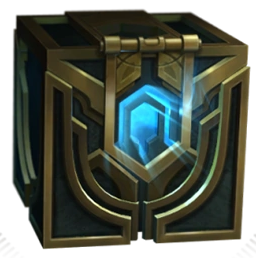

<!-- PROJECT SHIELDS -->
<!--
*** I'm using markdown "reference style" links for readability.
*** Reference links are enclosed in brackets [ ] instead of parentheses ( ).
*** See the bottom of this document for the declaration of the reference variables
*** for contributors-url, forks-url, etc. This is an optional, concise syntax you may use.
*** https://www.markdownguide.org/basic-syntax/#reference-style-links
-->

[![Contributors][contributors-shield]][contributors-url]
[![Issues][issues-shield]][issues-url]
[![MIT License][license-shield]][license-url]

<!-- PROJECT LOGO -->
<br />
<p align="center">
  <a href="https://github.com/radlinskii/lol-mastery-chest-viewer">
    
  </a>

  <h3 align="center">LoL Mastery Chest Viewer</h3>

  <p align="center">
    App that lets you preview champions' mastery chest availability of any summoner from EUNE region using Riot Games API
    <br />
    <br />
    <a href="https://lol-mastery-chest-viewer.herokuapp.com/">View Live</a>
    ·
    <a href="https://github.com/radlinskii/lol-mastery-chest-viewer/issues">Report Bug</a>
    ·
    <a href="https://github.com/radlinskii/lol-mastery-chest-viewer/issues">Request Feature</a>
  </p>
</p>

<!-- TABLE OF CONTENTS -->

## Table of Contents

-   [About the Project](#about-the-project)
    -   [Built With](#built-with)
    -   [Deployed To](#deployed-to)
-   [Getting Started](#getting-started)
    -   [Prerequisites](#prerequisites)
    -   [Installation](#installation)
-   [Usage](#usage)
-   [Roadmap](#roadmap)
-   [Contributing](#contributing)
-   [License](#license)
-   [Contact](#contact)
-   [Acknowledgements](#acknowledgements)

<!-- ABOUT THE PROJECT -->

## About The Project

**LoL Mastery Chest Viewer** helps you quickly check which of your champions still have _Mastery Chests_ available in this season of _League of Legends_.
It can become handy if you are already in the _Champion Select_ menu and you are not sure on which champions you have already been granted the _Mastery Chest_.
It uses the data directly from official [Riot Games API](https://developer.riotgames.com).

> Currently, **LoL Mastery Chest Viewer** supports only the _EUNE_ servers.

### Built With

-   [Go](https://golang.org)
-   [React](https://reactjs.org) and [Create React App](https://create-react-app.dev)
-   [Material UI](https://material-ui.com)

### Deployed To

-   [Heroku](https://heroku.com) at [lol-mastery-chest-viewer.herokuapp.com](https://lol-mastery-chest-viewer.herokuapp.com)

<!-- GETTING STARTED -->

## Getting Started

To get a local copy up and running follow these simple steps:

### Prerequisites

1. **Golang** v1.13+ - see [official installation instructions](https://golang.org/doc/install)
2. **Node** v12+ - see [installation guide](https://nodejs.org/en/download)

### Installation

1. Clone the repo

    ```sh
    git clone https://github.com/radlinskii/lol-mastery-chest-viewer.git
    ```

2. Create `.env` file in the repository root folder and specify there following environment variables:

    ```dotenv
    RIOT_API_TOKEN=YOUR_RIOT_GAMES_API_TOKEN # get one at https://developer.riotgames.com
    PORT=1010 # Port for your API server
    ENV=development # environment, server is configured to accept CORS requests only in "development" environment
    ```

3. Create another `.env` file in the `/client` folder with:

    ```dotenv
    REACT_APP_API_URL='http://localhost:1010' # url to local API instance, this is used to benefit from CRA's hot-reload feature
    ```

4. Run the server

    ```sh
    go run main.go
    ```

5. Run client
    ```sh
    cd client
    npm install
    npm run start
    ```

<!-- USAGE EXAMPLES -->

## Usage

On the web app you can search for data of any summoner from the EUNE servers.


But if you are in _Champion Select_ menu you probably don't have time for that, so you can simply add a url with your _summoner_ name as a search parameter to your browser. When you visit the site the `summonerName` is used preload the content, so there will be no need for additional typing.

Go and check: <https://lol-mastery-chest-viewer.herokuapp.com/?summonerName=Lacertael>

<!-- ROADMAP -->

## Roadmap

See the [open issues](https://github.com/radlinskii/lol-mastery-chest-viewer/issues) for a list of proposed features (and known issues).

<!-- CONTRIBUTING -->

## Contributing

Contributions are what make the open source community such an amazing place to be learn, inspire, and create. Any contributions you make are **greatly appreciated**.

1. Fork the Project
2. Create your Feature Branch (`git checkout -b feature/AmazingFeature`)
3. Commit your Changes (`git commit -m 'Add some AmazingFeature'`)
4. Push to the Branch (`git push origin feature/AmazingFeature`)
5. Open a Pull Request

<!-- LICENSE -->

## License

Distributed under the MIT License. See [LICENSE][license-url] for more information.

<!-- CONTACT -->

## Contact

Ignacy Radliński - [@I9nachi](https://twitter.com/I9nachi)

<!-- ACKNOWLEDGEMENTS -->

## Acknowledgements

-   [@miszkur](https://github.com/miszkur)
-   [@benekin](https://github.com/benekin)

<!-- MARKDOWN LINKS & IMAGES -->
<!-- https://www.markdownguide.org/basic-syntax/#reference-style-links -->

[contributors-shield]: https://img.shields.io/github/contributors/radlinskii/lol-mastery-chest-viewer.svg?style=flat-square
[contributors-url]: https://github.com/radlinskii/lol-mastery-chest-viewer/graphs/contributors
[forks-shield]: https://img.shields.io/github/forks/radlinskii/lol-mastery-chest-viewer.svg?style=flat-square
[forks-url]: https://github.com/radlinskii/lol-mastery-chest-viewer/network/members
[stars-shield]: https://img.shields.io/github/stars/radlinskii/lol-mastery-chest-viewer.svg?style=flat-square
[stars-url]: https://github.com/radlinskii/lol-mastery-chest-viewer/stargazers
[issues-shield]: https://img.shields.io/github/issues/radlinskii/lol-mastery-chest-viewer.svg?style=flat-square
[issues-url]: https://github.com/radlinskii/lol-mastery-chest-viewer/issues
[license-shield]: https://img.shields.io/github/license/radlinskii/lol-mastery-chest-viewer.svg?style=flat-square
[license-url]: https://github.com/radlinskii/lol-mastery-chest-viewer/blob/master/LICENSE
